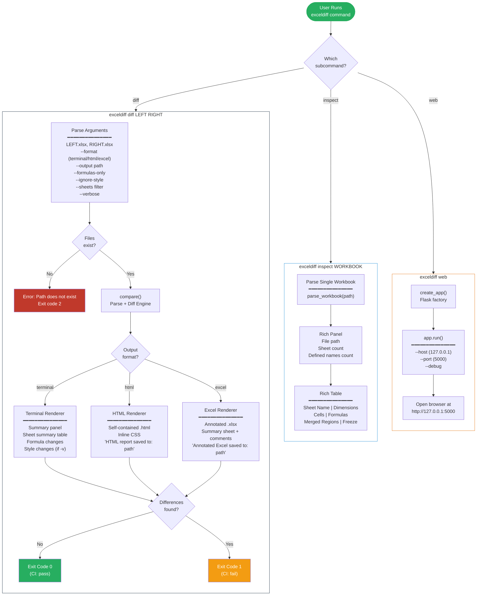
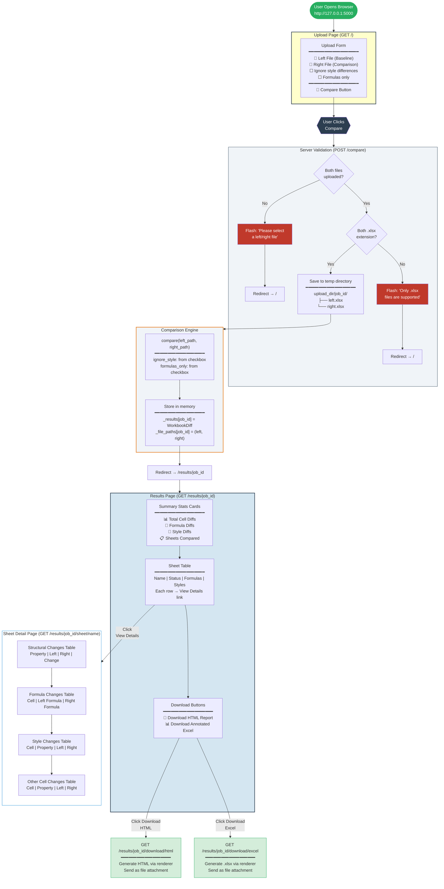
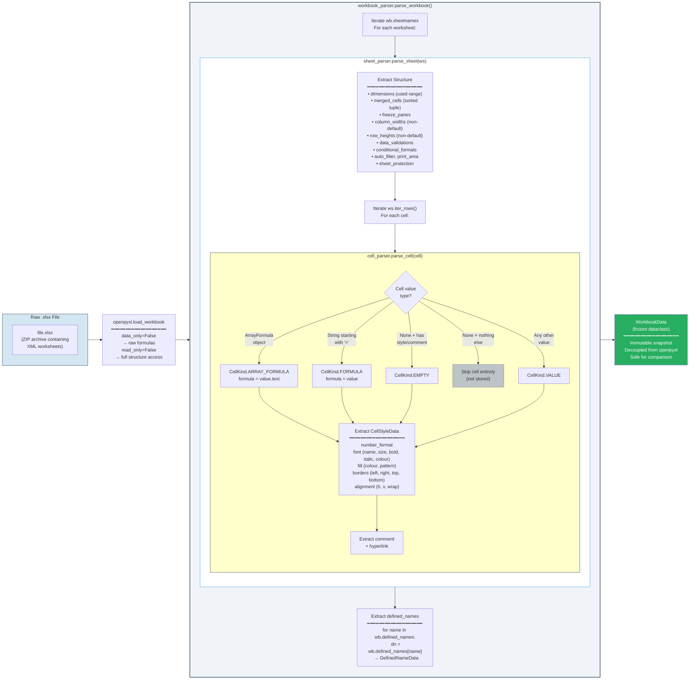
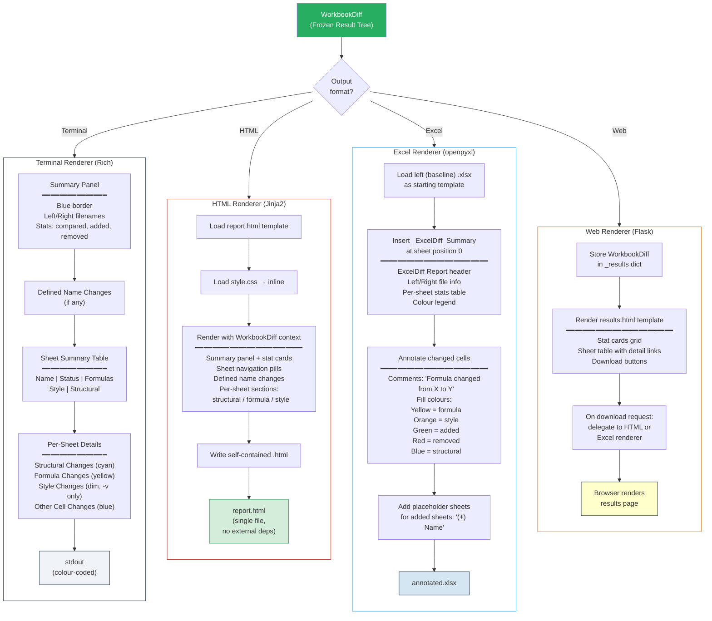
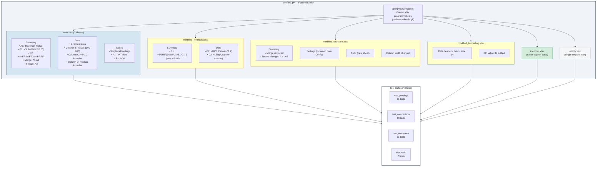
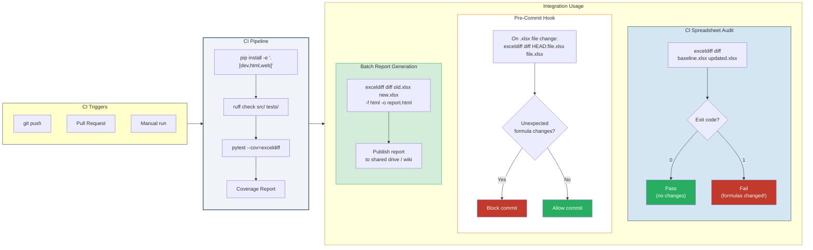

# ExcelDiff - Process Maps

Visual process maps documenting how the application works, how users interact with each interface, and how data flows through the comparison pipeline. All diagrams use [Mermaid](https://mermaid.js.org/) syntax and render natively in GitHub and VSCode.

---

## 1. High-Level System Flow

The core pipeline from input files to output report, showing all entry points and output formats.

```mermaid
graph TB
    subgraph INPUTS["Input Sources"]
        direction LR
        CLI["CLI<br/>exceldiff diff"]
        WEB["Web UI<br/>Browser Upload"]
        API["Python API<br/>compare() function"]
    end

    subgraph FILES["Excel Files"]
        direction LR
        LEFT["LEFT.xlsx<br/>(Baseline)"]
        RIGHT["RIGHT.xlsx<br/>(Comparison)"]
    end

    INPUTS --> FILES

    FILES --> PARSE

    subgraph PARSE["Parsing Layer"]
        direction TB
        WBP["workbook_parser<br/>━━━━━━━━━━━━━━━<br/>openpyxl.load_workbook<br/>(data_only=False)"]
        WBP --> SP["sheet_parser<br/>━━━━━━━━━━━━━━━<br/>Merged cells, freeze panes<br/>Column widths, row heights<br/>Validations, conditions"]
        SP --> CP["cell_parser<br/>━━━━━━━━━━━━━━━<br/>Formula detection<br/>Style normalisation<br/>Comment extraction"]
    end

    PARSE --> SNAPSHOT["WorkbookData<br/>(Frozen Snapshots)<br/>━━━━━━━━━━━━━━━<br/>Left + Right"]

    SNAPSHOT --> ENGINE

    subgraph ENGINE["Comparison Engine"]
        direction TB
        WBC["workbook_comparator<br/>Sheet set operations<br/>Defined name diffs"]
        WBC --> SC["sheet_comparator<br/>Structural property diffs"]
        SC --> CC["cell_comparator<br/>Formula + style comparison<br/>(case-insensitive)"]
    end

    ENGINE --> RESULT["WorkbookDiff<br/>(Frozen Result Tree)<br/>━━━━━━━━━━━━━━━<br/>has_differences: bool<br/>total_formula_diffs: int"]

    RESULT --> RENDER

    subgraph RENDER["Output Renderers"]
        direction LR
        TERM["Terminal<br/>(Rich)"]
        HTML["HTML Report<br/>(Jinja2)"]
        EXCEL["Annotated Excel<br/>(openpyxl)"]
        WEBUI["Web Results<br/>(Flask Templates)"]
    end

    style INPUTS fill:#FFFFCC,stroke:#2C3E50
    style FILES fill:#D4E6F1,stroke:#2C3E50
    style PARSE fill:#f0f4f8,stroke:#34495E,stroke-width:2px
    style ENGINE fill:#f0f4f8,stroke:#E67E22,stroke-width:2px
    style RENDER fill:#d4edda,stroke:#27AE60,stroke-width:2px
    style SNAPSHOT fill:#D4E6F1,stroke:#2C3E50
    style RESULT fill:#27AE60,color:#fff
```

---

## 2. CLI User Workflow

The complete journey of a user running ExcelDiff from the command line.

---

## 3. Web UI User Interaction Flow

The end-to-end journey of using the Flask web interface to compare workbooks.

---

## 4. Parsing Pipeline

How a raw .xlsx file is transformed into an immutable `WorkbookData` snapshot, cell by cell.

---

## 5. Comparison Engine Pipeline

How two `WorkbookData` snapshots are compared to produce a `WorkbookDiff` result tree.

```mermaid
flowchart TD
    subgraph INPUTS["Parsed Snapshots"]
        direction LR
        LEFT["WorkbookData<br/>(Left / Baseline)"]
        RIGHT["WorkbookData<br/>(Right / Comparison)"]
    end

    INPUTS --> OPTIONS

    subgraph OPTIONS["Comparison Options"]
        direction LR
        OPT1["ignore_style: bool<br/>Skip all style comparison"]
        OPT2["formulas_only: bool<br/>Only compare formulas"]
        OPT3["sheet_filter: tuple<br/>Compare specific sheets only"]
    end

    OPTIONS --> WBC

    subgraph WBC["workbook_comparator.compare_workbooks()"]
        direction TB

        SETOPS["Sheet Set Operations<br/>━━━━━━━━━━━━━━━━━━━<br/>left_names = set(left.sheet_names)<br/>right_names = set(right.sheet_names)<br/>━━━━━━━━━━━━━━━━━━━<br/>only_in_left = left - right<br/>only_in_right = right - left<br/>in_both = left & right"]

        SETOPS --> FILTER{"sheet_filter<br/>specified?"}
        FILTER -->|Yes| APPLY["in_both &= set(sheet_filter)"]
        FILTER -->|No| COMPARE

        APPLY --> COMPARE

        COMPARE["For each sheet in_both:"]

        COMPARE --> SC

        subgraph SC["sheet_comparator.compare_sheets()"]
            direction TB

            STRUCTURAL["Compare Structural Properties<br/>━━━━━━━━━━━━━━━━━━━━━━━━━<br/>dimensions, merged_cells (set ops),<br/>freeze_panes, column_widths (dict merge),<br/>row_heights, auto_filter, print_area,<br/>sheet_protection, data_validations,<br/>conditional_formats"]

            STRUCTURAL --> CC

            subgraph CC["cell_comparator.compare_cells()"]
                direction TB

                UNION["Union all coordinates<br/>━━━━━━━━━━━━━━━━━━━<br/>all_coords = left_cells.keys()<br/>             | right_cells.keys()"]

                UNION --> EACH["For each coordinate:"]

                EACH --> CLASS{"Cell in<br/>which set?"}

                CLASS -->|"Left only"| REM["CellDiff<br/>change_type = REMOVED"]
                CLASS -->|"Right only"| ADD["CellDiff<br/>change_type = ADDED"]
                CLASS -->|"Both"| CMP["Compare cell pair"]

                CMP --> FORMULA["Formula Comparison<br/>━━━━━━━━━━━━━━━━━━━<br/>left.formula.upper()<br/>  vs<br/>right.formula.upper()<br/>(case-insensitive)"]

                CMP --> KIND["Kind Comparison<br/>━━━━━━━━━━━━━━━━━━━<br/>FORMULA ↔ VALUE<br/>VALUE ↔ EMPTY<br/>etc."]

                CMP --> STYLECMP["Style Comparison<br/>(if not ignore_style)<br/>━━━━━━━━━━━━━━━━━━━<br/>Compare each of 15<br/>CellStyleData fields"]

                FORMULA --> CELLDIFF
                KIND --> CELLDIFF
                STYLECMP --> CELLDIFF

                CELLDIFF["CellDiff<br/>━━━━━━━━━━━━━━━<br/>formula_changed: bool<br/>style_changed: bool<br/>properties: [PropertyDiff]"]
            end

            CC --> SHEETDIFF["SheetDiff<br/>━━━━━━━━━━━━━━━<br/>structural_diffs<br/>cell_diffs<br/>change_type"]
        end

        SC --> DNCOMP["Compare Defined Names<br/>━━━━━━━━━━━━━━━━━━━<br/>Set operations on name keys<br/>Value comparison for shared names"]
    end

    WBC --> RESULT["WorkbookDiff<br/>━━━━━━━━━━━━━━━━━━━<br/>sheet_diffs<br/>defined_name_diffs<br/>sheets_only_in_left/right<br/>━━━━━━━━━━━━━━━━━━━<br/>has_differences: bool<br/>total_formula_diffs: int<br/>total_cell_diffs: int<br/>total_style_diffs: int"]

    style INPUTS fill:#D4E6F1,stroke:#2C3E50
    style OPTIONS fill:#FFFFCC,stroke:#2C3E50
    style WBC fill:#f0f4f8,stroke:#E67E22,stroke-width:2px
    style SC fill:#fff,stroke:#3498DB
    style CC fill:#fff,stroke:#F39C12
    style RESULT fill:#27AE60,color:#fff
    style REM fill:#C0392B,color:#fff
    style ADD fill:#27AE60,color:#fff
```

---

## 6. Output Rendering Pipeline

How a `WorkbookDiff` result is transformed into each output format.

---

## 7. Test Fixture Architecture

How the 6 test workbooks are created programmatically and used across test suites.

---

## 8. CI/CD & Integration Pipeline

How ExcelDiff integrates into automated workflows and CI pipelines.

---

## Diagram Legend

| Symbol | Meaning |
|--------|---------|
| Rounded rectangle | Start/end point |
| Rectangle | Screen, process step, or component |
| Diamond | Decision point |
| Hexagon | User action |
| Cylinder | Database / persistent storage |
| Dashed arrow | Optional or conditional path |
| Solid arrow | Primary flow direction |

### Colour Coding

| Colour | Usage in Diagrams |
|--------|-------------------|
| Yellow (#FFFFCC) | User inputs / options / configuration |
| Light Blue (#D4E6F1) | Data / file storage / snapshots |
| Green (#27AE60) | Start points / success states / final output |
| Dark Blue (#2C3E50) | User action buttons |
| Orange (#E67E22) | Comparison engine / processing |
| Red (#C0392B) | Error states / removed items |
| Blue (#3498DB) | Detail views / structural elements |
| White | Screen content areas |
| Light grey (#f0f4f8) | Service / processing layers |
